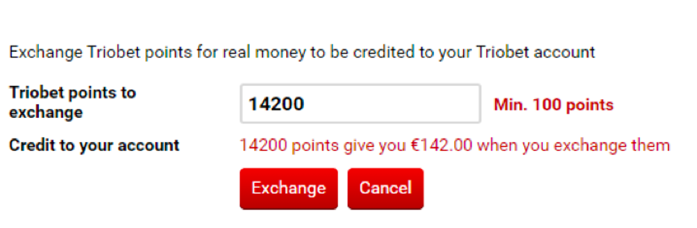

## Задание 3

> На вебсайте представлена форма вывода денег со счёта.

> Какие тест-кейсы вы бы предложили?
Какие вопросы вы бы задали аналитику перед разработкой тест-кейсов?

**Вопросы аналитику:** Завершена ли работа над требованиями к ПО? Узнаём, какой функционал у кнопки “Cancel” (допустим она очищает поле ввода). А также убеждаемся, что вводимое число должно быть чётным. Если по спецификации вопросов нет, требования описаны в полном объёме, то можно приступать к написанию тест-кейсов на основе спецификации.

### Test-case #1 (Проверка вывода средств)

| Номер | Заголовок  | Предусловие  |
|:----------|:----------|:----------|
| ex3.1   | Вывод средств через форму | Открываем страницу с фор-мой |

**Шаги:**
- Вводим значение в поле «Triobet points to exchange»
- Нажимаем кнопку «Exchange»

| Вводимое значение | Ожидаемый результат |
|:----------|:----------|
| Любое число < 100 | Ошибка – «Min. 100 points» |
| Дробное число > 100 | Ошибка – «Число должно быть целым» |
| Любое отрицательное число | Ошибка – «Min. 100 points» |
| Целое число >= 100 | Ошибка – «Этаж отсутствует» |
| Пустые поля | Ошибка – «Поля не могут быть пустыми» | 
| Ввод несовместимых символов | Ошибка – «Введите число» | 

### Test-case #2 (Проверка очистки поля)

| Номер | Заголовок  | Предусловие  |
|:----------|:----------|:----------|
| ex3.2   | Очистка поля ввода | Открываем страницу с фор-мой |

**Шаги:**
- Вводим любое значение в поле «Triobet points to exchange»
- Нажимаем кнопку «Cancel»

**Ожидаемый результат:**
*Очистка поля «Triobet points to exchange»*

Вернуться [назад](../Day%201)