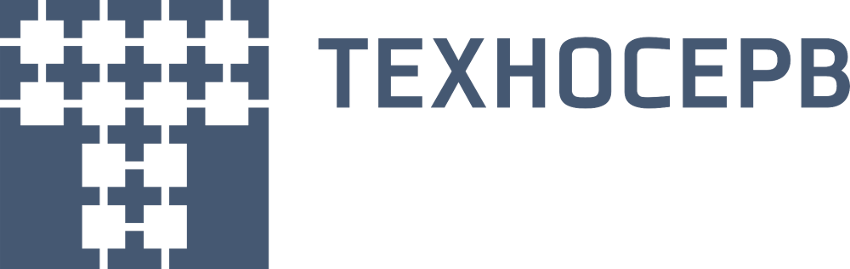

# Обучение по автоматизированному тестированию

**Преподаватель:** [Сидоров Игорь](https://github.com/idsidorov)

Программа обучения:
- Тема 1. Основы тестирования.
- Тема 2. Тест дизайн и тестовая документация
- Тема 3. Введение в базы данных, основы SQL
- Тема 4. Основы Java.
- Тема 5. Введение в автоматизацию тестирования. .
- Тема 6. Автоматизация тестирования веб-сервисов.
- Тема 7. Автоматизация тестирования UI веб-приложений.
- Тема 8. Инфраструктура для автотестов.

Домашние задания:
- [День 1](Day%201)
- [День 2](Day%202)
- [День 3](Day%203)
- [День 4](Day%204)